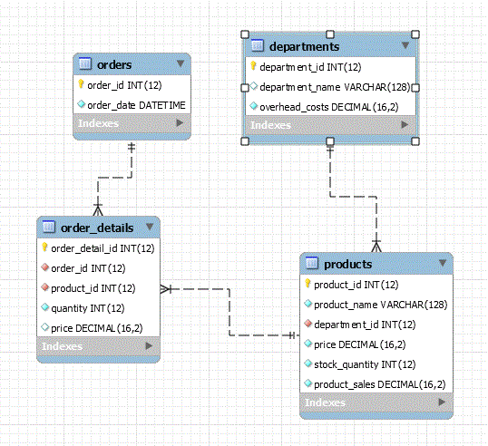

# Bamazon - Node.js & MySQL

## Overview

Create an Amazon-like storefront with a MySQL backend and a HTML/CSS Bootstrap frontend. The app displays and manages products and departments, takes in orders from customers, and depletes stock from the store's inventory. The app also allows you to track product sales across the store's departments and then provides a summary of the highest-grossing departments in the store.

### GitHub Access

- [Source code repository](<https://github.com/pvraab/bamazon>)
- [Application URL](<https://pvraab-bamazon.herokuapp.com/>) - Hosted on Heroku so we can run the Express server and use the JawsDB MySQL server.

### Challenges

This was a pretty straightforward application to develop. The use of a view to deliver the product sales by department and total profit functionality was an interesting exercise. Setting up the app to run on Heroku was also interesting.

### Detailed Functionality and Results

This application uses a MySQL database to structure and store information for this application (see the appendix for the relevant SQL scripts).

- Use a MySQL Database called bamazon.
- One table inside of that database is called products.
  - The products table has the following columns:
    - item_id (unique id for each product)
    - product_name (name of product)
    - department_id (foreign key to department table to get department name)
    - price (cost to customer)
    - stock_quantity (how much of the product is available in stores)
    - product_sales column (when a customer purchases anything from the store, the price of the product multiplied by the quantity purchased is added to the product's product_sales column)
  - This database table is initially populated with 10 different products.
- A MySQL table called departments. 
  - This table includes the following columns:
    - department_id (unique id for each department)
    - department_name (name of department)
    - overhead_costs (the overhead cost of each department)
- A MySQL table called orders.
  - This table includes the following columns:
    - order_id  (unique id for each order)
    - order_date (date order placed)
- A MySQL table called order_details.
  - This table includes the following columns:
    - order_detail_id
    - order_id
    - product_id
    - quantity
    - price



Several HTML pages are used to view and manage the data in these tables.

### Main View

- The Main view presents the user with a splash page with a number of buttons and links that allow access to different functions.


- The "View Products" button selects the Product view where products can be viewed, added, and edited.
- The "View Departments" button selects the Department view where departments can be viewed, added, and edited.
- The "Product Sales By Department" button selects the view where total product sales by department can be viewed.
- The "Create Order" button selects the Order view where a user can create and manage an order.
- The "View Orders" button selects the Order view where order can be viewed.

### Product View

- Display all of the items available for sale including the ids, names, departments, prices, stock quantity, and current product sales.


- The user can update any product item by clicking on the "U" button at the right of each row. This will bring up a Modal where each field can be edited and then saved to the MySQL database.


- The user can also select the "Close" button to exit the Modal without updating the product.
- The "R" remove button at the end of each row will remove a product from the database.

### Department View

- Display all of the departments including the ids, names, and overhead costs.


- The user can update any department by clicking on the "U" button at the right of each row. This will bring up a Modal where each field can be edited and then saved to the MySQL database.


- The user can also select the "Close" button to exit the Modal without updating the department.
- The "R" remove button at the end of each row will remove a department from the database.

### Product Sales By Department View

- Display  a summarized table describing the summed product sales and the resulting total profit for each department. This functionality uses a SQL View prod_sales_by_dept described in the appendix of this document to dynamically calculate the total_profit value.all of the departments including the ids, names, and overhead costs.


### Create Order View

- Create an order.


- The user can select any of the products displayed by clicking on the "A" button at the end of each row.
- The products are then placed in an order table at the bottom of the page.


- The user can then update the quantities in the editable Quantity cell, they can remove a product from the order by clicking on the "R" remove button, or they can select the "Place your Order" button to place your order. When the order is placed, quantities in stock for each item are checked, and if sufficient, then an order is created in the database and existing stock quantities are decremented.

### Order View

- Display all orders and enable specific order selection and display.


- You select a specific order by clicking on a row and then the Order Details table is populated.


### Technologies Used

- HTML/CSS
- MySQL
- SQL
- Entity-Relationship diagram (ERD)
- JavaScript
- Express
- Node.js
- Heroku with JawsDB MySQL add on
- npm package mysql to allow connections to the MySQL database
- Good Quality Coding Standards used
- Deployed on [GitHub](<https://github.com/pvraab/bamazon>)

------

- Added To my portfolio at:

  [My Portfolio](<https://pvraab.github.io/RaabPortfolio/>) - navigate to the portfolio page.

### Appendix

ERD of bamazon schema


The following SQL scripts were used to create the bamazon schema objects:

#### Main bamazon schema to create the departments and products tables

```
DROP TABLE IF EXISTS order_details;
DROP TABLE IF EXISTS orders;
DROP TABLE IF EXISTS products;
DROP TABLE IF EXISTS departments;

-- Table departments
CREATE TABLE IF NOT EXISTS departments (
    department_id INT(12) NOT NULL AUTO_INCREMENT,
    department_name VARCHAR(128) NULL DEFAULT NULL,
    overhead_costs DECIMAL(16,2) NOT NULL DEFAULT '0.00',
    PRIMARY KEY (department_id),
    INDEX department_id (department_id ASC)
);

-- Table products
CREATE TABLE IF NOT EXISTS products (
    product_id INT(12) NOT NULL AUTO_INCREMENT,
    product_name VARCHAR(128) NOT NULL,
    department_id INT(12) NOT NULL,
    price DECIMAL(16,2) NOT NULL DEFAULT '0.00',
    stock_quantity INT(12) NOT NULL DEFAULT '0',
    product_sales DECIMAL(16,2) NOT NULL DEFAULT '0.00',
    PRIMARY KEY (product_id),
    INDEX product_id (product_id ASC),
    CONSTRAINT fk_departments_department_id FOREIGN KEY (department_id)
        REFERENCES departments (department_id)
        ON DELETE NO ACTION ON UPDATE NO ACTION
);

CREATE TABLE IF NOT EXISTS orders (
    order_id INT(12) NOT NULL AUTO_INCREMENT,
    order_date DATETIME NOT NULL DEFAULT CURRENT_TIMESTAMP,
    PRIMARY KEY (order_id),
    INDEX order_id (order_id ASC)
);

CREATE TABLE order_details (
    order_detail_id INT(12) NOT NULL AUTO_INCREMENT,
    order_id INT(12) NOT NULL,
    product_id INT(12) NOT NULL,
    quantity INT(12) NOT NULL DEFAULT '0',
    price DECIMAL(16,2) DEFAULT '0.00',
    PRIMARY KEY (order_detail_id),
    INDEX order_detail_id (order_detail_id ASC),
    CONSTRAINT fk_orders_order_id FOREIGN KEY (order_id)
        REFERENCES orders (order_id),
    CONSTRAINT fk_products_product_id FOREIGN KEY (product_id)
        REFERENCES products (product_id)
);
```

#### Product Sales By Department View

```
-- Create Product Sales by Department view
USE bamazon;

CREATE OR REPLACE VIEW prod_sales_by_dept AS
SELECT 
    a.department_id,
    a.department_name,
    a.overhead_costs,
    SUM(b.product_sales) product_sales,
    SUM(b.product_sales) - a.overhead_costs total_profit
FROM
    departments a,
    products b
WHERE
    a.department_id = b.department_id
GROUP BY b.department_id;

```

